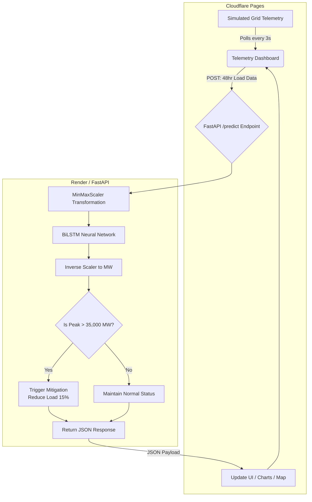

# ⚡ UrbanOptimizer (MicroGrid-AI)

**Autonomous load forecasting and dispatch for urban energy grids.**

UrbanOptimizer is an intelligent telemetry and predictive mitigation platform designed to monitor energy grids, forecast peak loads using deep learning, and automatically simulate preventative interventions (like dimming smart streetlights or pre-cooling buildings) before catastrophic grid failure occurs.

---

## 🌍 Overview

Urban grids face immense strain during peak hours, often leading to rolling blackouts or reliance on expensive, high-emission "peaker" power plants. UrbanOptimizer addresses this by feeding rolling 48-hour historical load data into a highly accurate **Bidirectional Long Short-Term Memory (BiLSTM)** neural network. 

If the model predicts that the upcoming load will breach critical capacity (e.g., >35,000 MW), the system automatically triggers a demand-response mitigation protocol, slashing the expected load by 15% and averting the blackout.

---

## 🚀 Key Features

*   **Deep Learning Forecasting:** Utilizes a trained BiLSTM neural network boasting a **98.8% R² accuracy** on a 24-hour predictive horizon.
*   **Live Telemetry Dashboard:** A beautifully designed, dark-themed UI (built with Tailwind, Chart.js, and Leaflet) that polls grid data in real-time.
*   **Automated Mitigation Engine:** Autonomous threshold monitoring that triggers simulated load-shedding actions without human intervention.
*   **FastAPI Backend:** Lightweight, lightning-fast Python API for processing telemetry streams and executing AI inference.
*   **Edge-Ready Architecture:** Designed to be decoupled—frontend hosted on edge networks (Cloudflare Pages) and AI backend hosted on cloud servers (Render).

---

## 💡 Detailed Use Cases

### 1. Smart City Grid Operators
Municipalities can integrate UrbanOptimizer with their central grid software. By forecasting energy spikes hours in advance, city operators can automatically send signals to IoT-connected infrastructure to reduce power draw (e.g., dimming streetlights by 10%, adjusting municipal thermostat setpoints).

### 2. Industrial Microgrids
Large manufacturing plants or server farms operate on localized microgrids. UrbanOptimizer can predict when the facility is about to draw too much power from the main grid (incurring massive peak-demand pricing fees) and automatically switch the facility to backup battery/solar power to shave the peak.

### 3. VPPs (Virtual Power Plants)
Energy aggregators can use this model to forecast when the macro-grid will be under the most stress. During these critical windows, the VPP can autonomously discharge aggregated residential batteries (like Tesla Powerwalls) into the grid, stabilizing it and earning revenue for homeowners.

---

## 🧠 How It Works (System Flow)

The architecture is split into a live telemetry simulator/frontend and an AI inference backend.

## The Pipeline
* 1. **Ingestion** : The frontend simulates real-time power draw (based on historical patterns + noise) and sends a rolling 48-hour array of data to the backend.
* 2. **Inference** : The FastAPI backend receives the data, normalizes it using scaler.pkl, and feeds it into urban_optimizer_model.keras.
* 3. **Threshold Logic** : The AI outputs a peak forecast. If it exceeds 35,000 MW, the "Urban Optimization" logic triggers.
* 4. **Action** : The API returns a payload detailing the averted spike. The frontend instantly visualizes the intervention on the Leaflet map and Chart.js graphs.

## Project Structure

MicroGrid-AI/
│
├── app.py                      # FastAPI backend & optimization logic
├── index.html                  # Live dashboard UI & telemetry simulator
├── requirements.txt            # Python dependencies (FastAPI, TensorFlow, etc.)
├── urban_optimizer_model.keras # Pre-trained BiLSTM Neural Network
├── scaler.pkl                  # Scikit-Learn data normalizer
├── Smart_Grid.ipynb            # Original Jupyter Notebook for training the AI on PJM data
└── README.md                   # Project documentation

## Live Website

* **URL to live website** : https://urban-optimizer.pages.dev/